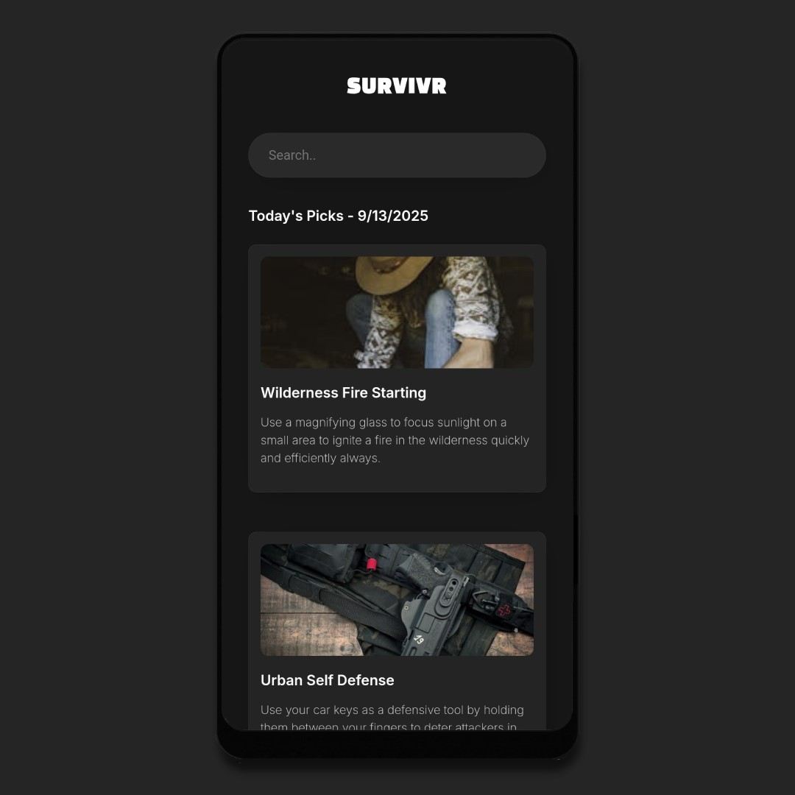

# Survivr

<table>
  <tr>
    <td width="200">
      
    </td>
    <td>
      <p>
        <b>Survivr</b> is a React web app that showcases daily survival life hacks for various environments and situations.  
        Explore categorised hacks, click any card for a “Did you know?” fact, search through the generated cards, and filter them by category.  
        The design is fully responsive, working smoothly across desktops, tablets, and phones.
      </p>
    </td>
  </tr>
</table>

---

## 🖼️ Screenshots

### Main Features
| Home Screen | Did You Know? |
|------------|--------------|
|  |  |

| Filter | Search |
|--------|--------|
|  |  |

### Responsive Views
| Desktop View | Tablet View | Phone View |
|--------------|------------|------------|
|  |  |  |

---

## 🎥 Demo Video

<a href="https://www.youtube.com/watch?v=bjlqcpYqDfo">
  
</a>  

A walkthrough of the app which includes browsing hacks, searching/filtering, and exploring the responsive design.

---

## ⚙️ Tech Stack

- **React.js + Vite** – Frontend framework/setup
- **HTML5** & **CSS3** – Structure and styling
- **Spring Boot (Java 17)** – Backend
- **Groq Llama API** – Survival content
- **Pexels API** – Related images

---

## ⚠️ Heads Up

The backend is hosted on a free service, so it may **sleep when idle**. This means the **first request might take a few seconds** to wake up.  
All features still work, but the **daily survival cards may refresh earlier than intended** when the server restarts.  
For the smoothest experience, clone the repo and run the backend locally.

---

## 🛠️ Setup Guide

### Frontend (React + Vite)

1. Clone the repo:
   
   ```bash
   git clone https://github.com/AntoOfo/survivr-web
   cd survivr-web
    ```
2. Install dependencies:
   
   ```bash
   npm install
    ```
3. Update the fetch URLs in your frontend code to point to your backend.
   
4. Run the app locally:
   ```bash
   npm run dev
    ```

### Backend (Spring Boot - Java 17)

1. Navigate to **survivr-backend/**.
   
2. Add your API keys in **src/main/resources/application.properties**:
   
   ```bash
   groq.api.key=YOUR_GROQ_API_KEY
   pexels.api.key=YOUR_PEXELS_API_KEY
    ```
3. (Optional) Remove or adjust any **@CrossOrigin** settings if you plan to run locally.
   
4. Run locally:
   ```bash
   mvnw spring-boot:run
    ```

---

## 📁 License

Licensed under the MIT License.
